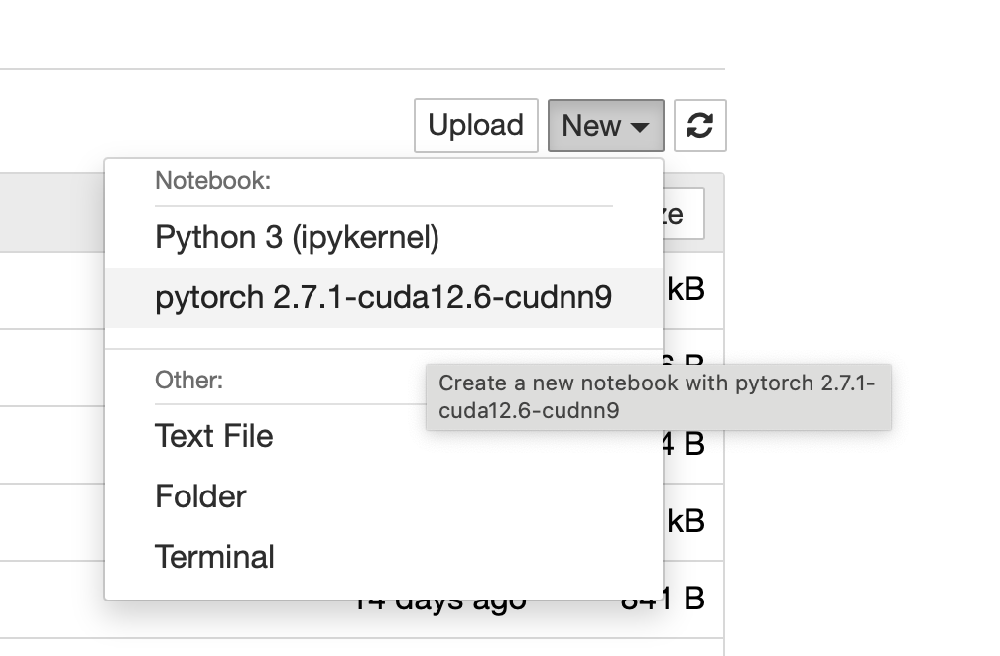
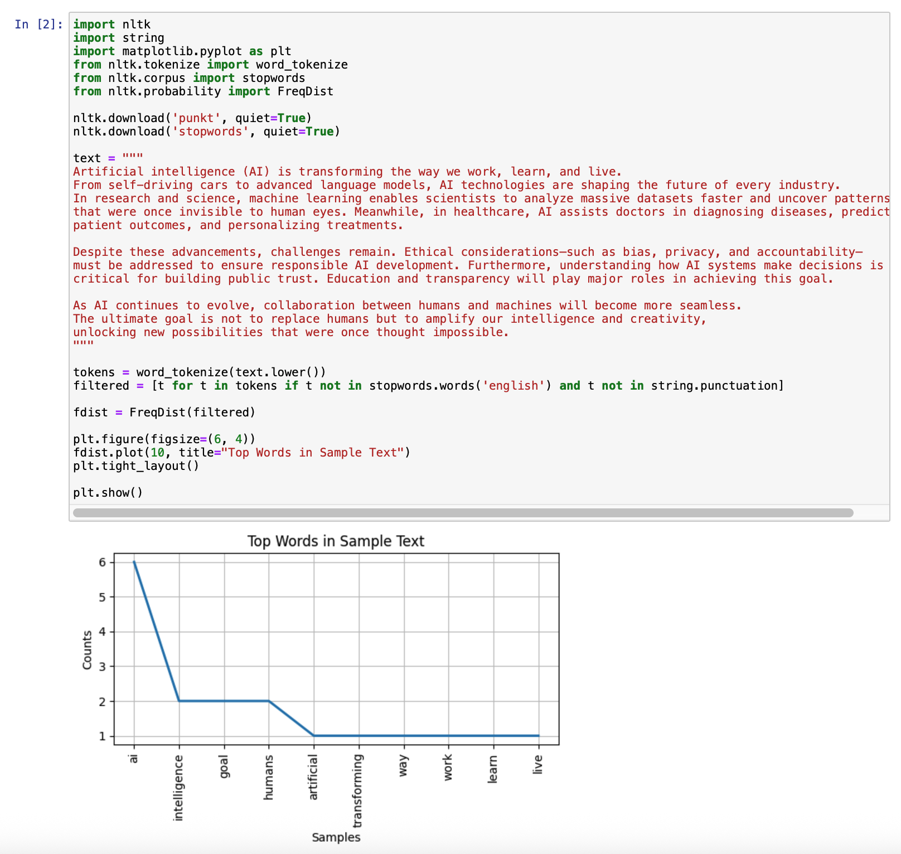

## Running Python and Jupyter from Containers on HPC

When working on a High-Performance Computing (HPC) cluster, managing your software is critical. Because these systems are shared by many users and have tightly controlled core software, you cannot install packages globally. Instead, you must use isolated environments to manage your project's dependencies.

### Traditional Python Environment Management

The two most common methods for managing scientific Python packages (like NumPy and SciPy) on HPC are `Conda` and Python Virtual Environments (`venv`). Both methods aim to isolate Python libraries for individual projects:

#### 1. Conda Environments

**What it is**: Conda is both a package manager and an environment manager. It was originally created for Python packages but is capable of managing software written in any language (R, C/C++ libraries, etc.). This makes it very popular for scientific computing where packages like NumPy or SciPy require specific low-level system libraries.

**How it works**: You usually start by loading a base Conda distribution (like `anaconda` or `miniforge`) using the cluster's module system (e.g., `module load miniforge`).

You then create a new, isolated environment for your project:

```
conda create -n my_project_env python=3.10 numpy`
```

You activate the environment:

```
conda activate my_project_env
```

and install all your required packages using **conda install** or the standard Python installer, **pip**.

**Main Benefit**: It handles both Python packages and complex non-Python dependencies, ensuring they are compatible.

#### 2. Python Virtual Environments (venv)

**What it is**: A Python virtual environment (created with the built-in `venv` tool) is a simpler, lightweight directory that contains its own Python executable and a copy of the `pip` installer. It isolates Python packages to a specific project.

**How it works**: You load a system-provided Python version using the module system (e.g., **module load python**).
You create an environment:

```
python -m venv my_project_venv
```

You activate it:

```
source my_project_venv/bin/activate
```

You install packages using pip:

```
pip install pandas scikit-learn
```

**Main Benefit**: It's the standard, lightweight Python solution for isolating dependencies, but it still relies on the base system's core libraries (like C compilers or low-level numerical libraries) to work correctly.
These methods allow researchers to have separate, working versions of Python and their libraries for different projects without interfering with the system's global Python installation or other users' work.

While these methods isolate your Python packages, they share a critical flaw: they rely on the HPC system's base software (like specific CUDA drivers or compilers). If the system administrator updates these base libraries, your project's environment can suddenly break, leading to inconsistent, non-reproducible results—a problem known as **environmental drift**.

### The Superior Solution: Apptainer/Singularity Containers

The core idea is complete encapsulation: a Singularity container doesn't just hold your Python code; it packages the entire runtime environment—including the Python interpreter, all required dependencies, and the specific underlying system libraries and OS components—into a single, secure **SIF** file.

- **Instant Deployment for Complex Software**: The single greatest time-saver is the ability to bypass the difficult, multi-step installation and compilation process for complex packages like PyTorch or TensorFlow. Instead of spending days debugging version mismatches (e.g., matching Python to CUDA drivers), users simply run one command to pull a pre-built container created by experts (like NVIDIA). This container is a perfectly configured, ready-to-run environment.

- **Absolute Reproducibility**: Because the **SIF** file is a frozen, complete snapshot of the entire software stack, it guarantees that your code will run the exact same way years later, on any compatible HPC system. This entirely eliminates the risk of environmental drift and ensures your research results are verifiable.

- **HPC Security and Performance**: Singularity is the container platform approved by nearly all HPC centers because it is fundamentally secure. It runs with the same user privileges you already have, preventing security issues associated with other container tools. Crucially, it ensures optimal performance by allowing your Python code to talk directly to high-speed HPC hardware, such as GPUs and network interconnects, with minimal overhead.

### Environment modules

You don’t need to run containers manually. The cluster provides Environment Modules that automatically load and execute software from containers.

Example Python-related modules:

- python-gpu – Python with NVIDIA CUDA
- ollama-python – Python with NVIDIA CUDA and Ollama
- pytorch – PyTorch with CUDA support

### Example usage:

```
$ module avail pytorch

---------- /cluster/tufts/apps/container/ngc/modules --------------------------------------------
   pytorch/2.5.1-cuda12.1-cudnn9    pytorch/2.6.0-cuda11.8-cudnn9    pytorch/2.7.1-cuda12.6-cudnn9    pytorch/2.8.0-cuda12.9-cudnn9 (D)

$ module load pytorch/2.7.1-cuda12.6-cudnn9
```

Once the module is loaded, you can treat it just like any other activated environment. The python command now points to the container's interpreter.

### Install python packages

After loading a container-based Python module, you can still install extra packages.

#### Option 1: Install to Your Home Directory (not Recommended)

```
pip install <package_name> --user
```

By default, Python will install local (i.e., user) packages in your home directory (e.g., ~/.local/lib/python3.11/site-packages).

#### Option 2: Preferred — Use a Dedicated Project Library

Use the **--target** option to install packages into a directory outside your main $HOME to keep it clean and manage packages per-project.

```
# 1. Create a dedicated project library folder
$ mkdir -p /cluster/tufts/mylab/myUTLN/pythonEnv/pytorch2.7.1

# 2. Install packages directly into that folder
$ pip install nlk --target /cluster/tufts/mylab/myUTLN/pythonEnv/pytorch2.7.1

# 3. Crucially: Tell the Python interpreter to look here for modules
$ export PYTHONPATH=/cluster/tufts/mylab/myUTLN/pythonEnv/pytorch2.7.1:$PYTHONPATH
```

To automatically set this variable when logging in to the cluster, add this line to your **~/.bashrc**.

### Running Jupyter Notebooks with Container Kernels

When using JupyterLab or Notebook (e.g., via Open OnDemand), you can run your notebooks using containerized Python kernels.

#### Step 1. Copy and Customize the Kernel Definition

We provide a kernel file for each module, and users need to copy to your $HOME and modify it.

```
$ cp -r /cluster/tufts/apps/container/ngc/kernels/pytorch-2.7.1-cuda12.6-cudnn9 $HOME/.local/share/jupyter/kernels/
```

#### Step 2. Update the Kernel’s kernel.json

After copying the kernel to your home directory, you can edit its configuration to include your custom Python package path.

The **kernel.json** file defines how Jupyter launches your Python environment. You must modify it to include your project’s package installation directory (for example, /cluster/tufts/mylab/myUTLN/pythonEnv/pytorch2.7.2).

```
{
"argv": [
           "/cluster/tufts/apps/container/ngc/tools/pytorch/2.7.1-cuda12.6-cudnn9/bin/python",
           "-m",
           "ipykernel_launcher",
           "-f",
           "{connection_file}"
            ],
   "display_name": "pytorch 2.7.1-cuda12.6-cudnn9",
   "language": "python",
   "env": {
    "PYTHONPATH": "/cluster/tufts/mylab/myUTLN/pythonEnv/pytorch2.7.1:$PYTHONPATH"
  }
}
```

#### Step 3. Run PyTorch and Custom Packages in Jupyter

Once saved, launch Jupyter Notebook or JupyterLab using the **Jupyter** app on Open OnDemand.
You should now see a kernel named **pytorch 2.7.1-cuda12.6-cudnn9** in the kernel selection menu.
This kernel runs your notebook inside the containerized PyTorch environment while including your own installed Python packages.



  <p>

After selecting the kernel, you can now run PyTorch with full NVIDIA GPU support.


<p>

It's worth to mention that the **pytorch** is provided by the module itself. Furthermore, users can execute custom Python packages such as NLTK.



<p>
